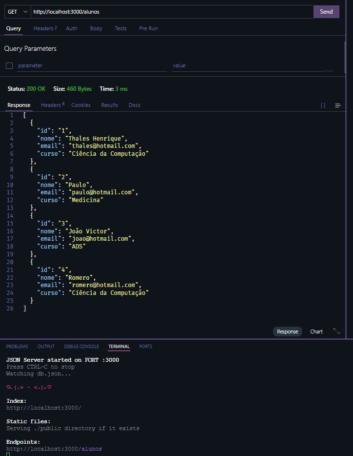

# Tecnologia Front-End III - Aula/Slide 05.

Repositório que contém atividades do slide 05.


## Comando para rodar o server com Banco de Dados usando Json-Server
```bash
json-server --watch db.json --port 3001
```

```bash
npm run dev
```


### Endpoints:

#### Lista todos alunos  do meu banco fake `db.json`
```bash
http://localhost:3001/alunos
```




### Tabela `GET` usando o DB Fake e Componente:


### Formulário `POST` para cadastrar novo aluno:


